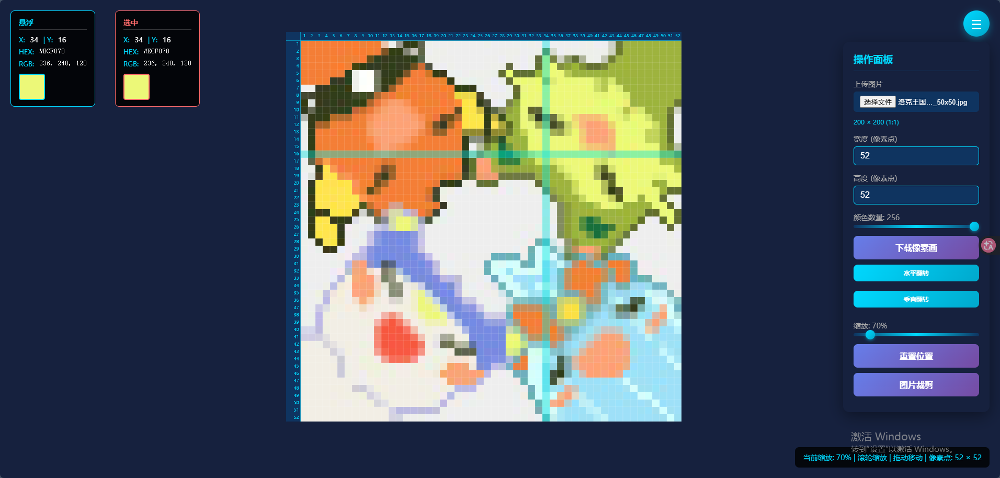

# 拼豆辅助工具


预览图   




使用方法：   
克隆项目或下载压缩包到本地后解压；   
双击index.html文件，在浏览器打开网页；   
根据自己板子大小或者想要的大小调整宽高像素点，上传图片查看效果图；   
鼠标悬浮和点击可查看像素点详细数据，鼠标滚轮可放大缩小，鼠标左键长按可以拖动；   
可以修改颜色数量，适用于颜色不多的情况；   
可以水平翻转；   
可以下载像素画图片；   
可以上传图片裁剪，裁剪后下载图片；   


## 其他工具

```
https://aigo.fan/
https://www.bitbead.app/zh/generator
http://playbeans.icbear.cn/

```