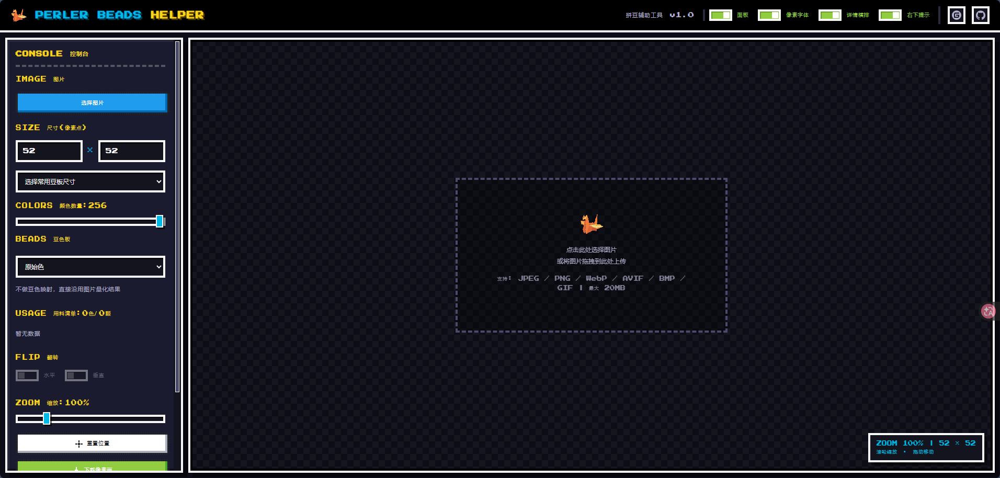
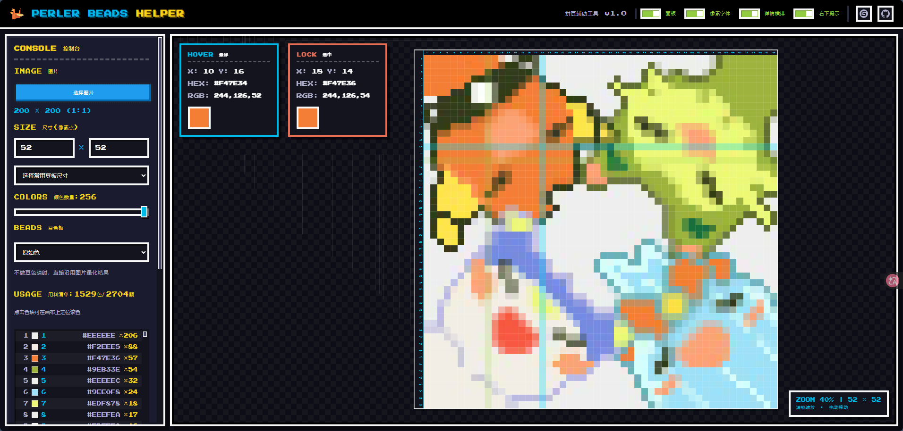
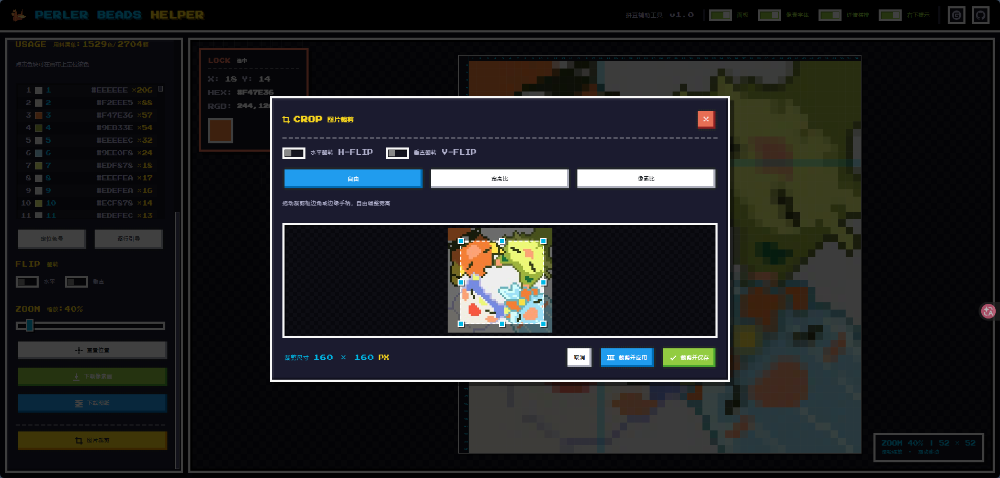
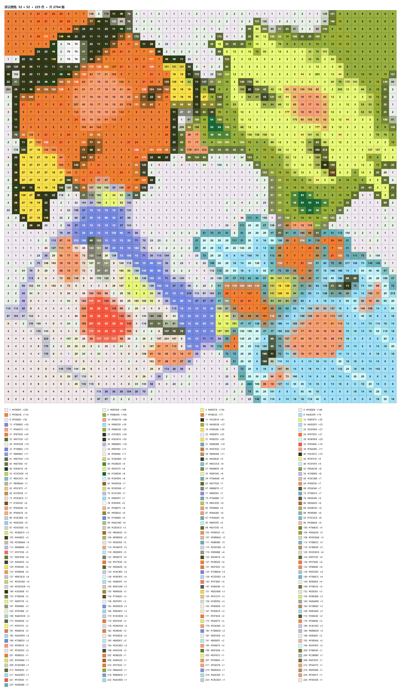
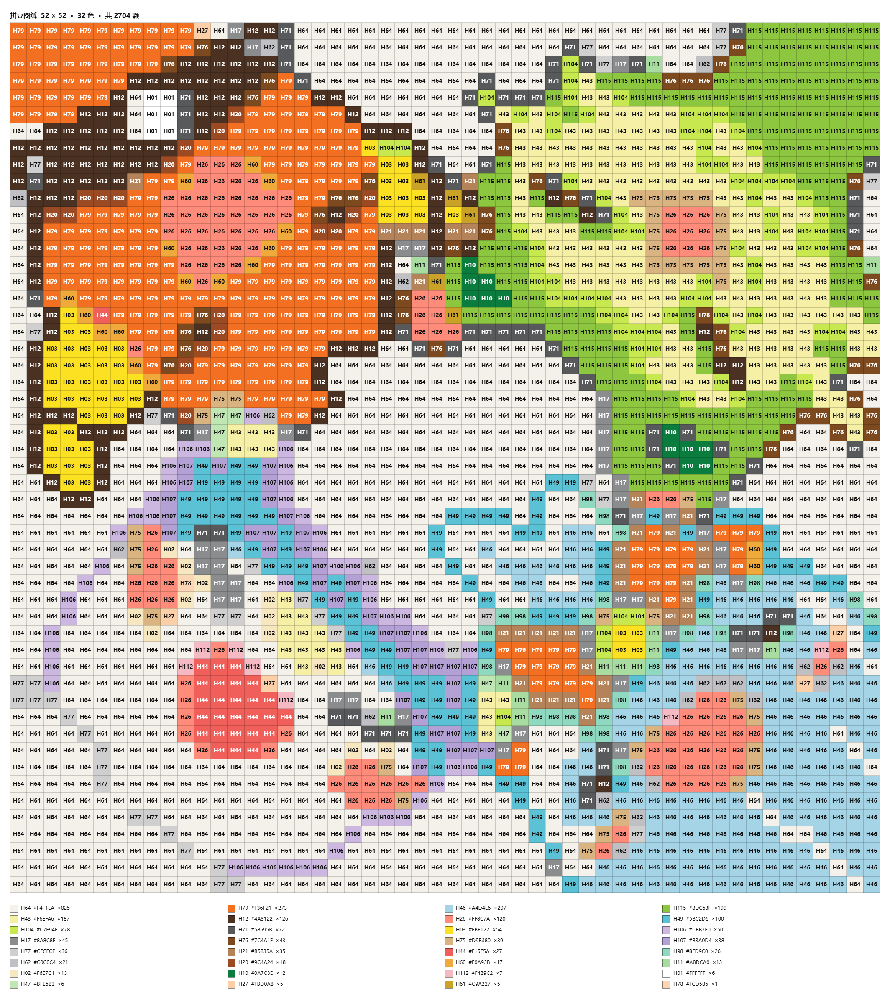
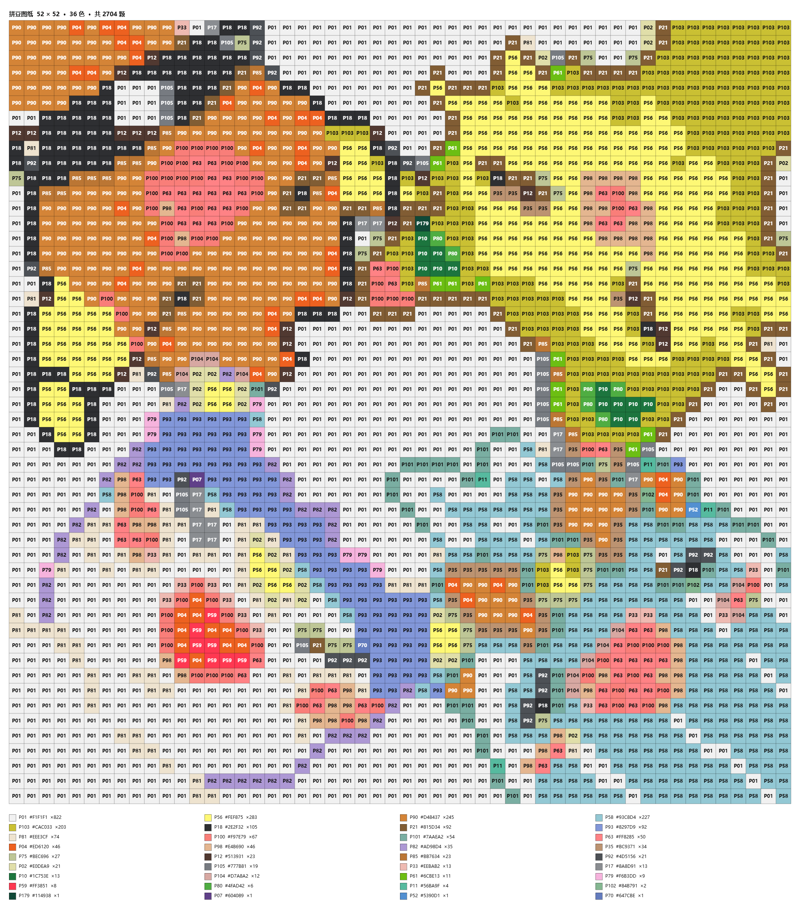
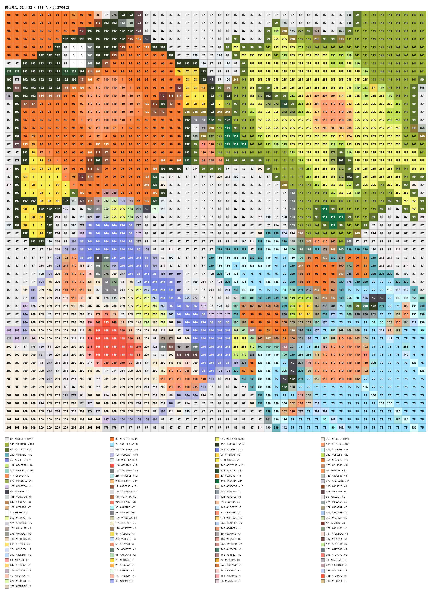

# 拼豆辅助工具

一款纯前端的拼豆图纸生成工具：上传图片 → 自动转成像素画 → 映射到真实在售豆色 → 导出带色号编号的图纸和用料清单。

图片全部在你的浏览器本地处理，不上传任何服务器；无需安装依赖、无需构建，双击 `index.html` 即可使用。

## 预览图

### 界面   

### 上传图片界面   

### 裁剪图片弹窗界面   

### 原始色图纸   

### Hama图纸   

### Perler图纸   

### 喵小窝图纸   


## 功能特性

### 图片导入

- 点击「选择图片」或直接把图片拖拽到预览区上传。
- 支持 JPEG / PNG / WebP / AVIF / BMP / GIF，单张上限 20MB；格式或体积不符合要求时会给出提示。
- 上传后显示原图的尺寸与宽高比。

### 像素尺寸

- 宽 × 高分别设置，范围 5–300 个像素点，自动取整并限制在区间内。
- 图片会按比例居中裁剪，适配目标尺寸，不会拉伸变形。
- 内置常用豆板尺寸预设，选中即写入宽高：
  - 15×15 小方板
  - 29×29 标准方板（5mm）
  - 52×52 迷你方板（2.6mm）
  - 58×58 四板拼接
  - 78×78 迷你大方板（2.6mm）
  - 104×104 迷你特大板（2.6mm）
  - 156×156（78×78 四板拼接）
  - 208×208（104×104 四板拼接）
  - 232×232（29×29 八板拼接）

### 颜色数量与豆色板

- **颜色数量**滑块可调 2–256 色，取图内用量最多的前 N 种颜色；拖动滑块时做了防抖处理，不会卡顿。
- **豆色板**可选，把像素画的颜色映射到真实在售豆色并标注色号：
  - 原始色：不做映射，直接沿用图片量化结果
  - Perler（美国 · 5mm midi · 58 色）
  - Hama（丹麦 · 5mm midi · 46 色）
  - 咪小窝（MARD 色卡对照 · 244 色）
- 选定豆色板后，超出颜色数量的颜色会就近合并到保留色，保证成品只出现买得到的豆色。

### 用料清单

- 左侧面板实时列出每种豆色的**色块 + 色号 + HEX + 颗数**，按用量从多到少排列，并汇总「N 色 / 共 M 颗」。
- 透明区域不计入用料统计。
- 悬浮某一行可看到颜色名称。

### 画布交互

- 鼠标悬浮或点击格子，可查看坐标、色号、HEX、RGB 和色块预览，并用十字线高亮当前行列。
- 滚轮缩放 10%–500%，也可用滑块调节。
- 长按鼠标左键拖动可平移画布，「重置位置」一键把画布居中或对齐左上角，保证标尺原点可见。
- 画布带行号 / 列号标尺（格子过小时刻度会自动抽稀，避免数字重叠）和像素网格线。

### 导出

- **下载像素画**：导出像素画 PNG，透明区域保持真透明。
- **下载图纸**：导出带编号的网格图纸 PNG，每个格子标注色号（未选豆色板时为用量序号），底部附颜色图例（色块 + 色号 + HEX + 颗数），可以直接照着拼。图幅很大时会自动缩小格子边长，避免超出浏览器画布上限。
- 两种导出都走 Blob 而非 base64，大图不会因为字符串膨胀而卡顿。

### 逐行引导与高亮定位

- **点击用料清单任意一行**，画布只点亮该色号的所有格子，其余淡化，一眼定位「这 37 颗 A12 在哪」。
- **逐行引导**模式只点亮当前行，可「上一行 / 下一行」推进，走完末行自动退出 —— 适合按行拼装时对照图纸。
- 两种模式互斥，避免叠加后看不清重点；顶部横幅实时显示当前定位的色号。

### 裁剪结果直连

- 裁剪弹窗底部除「裁剪并保存」外，新增「**裁剪并应用**」—— 裁剪结果直接进入生成流程，省掉「下载后再重新上传」这一步。

### 图片裁剪

- 独立的裁剪弹窗，可上传或拖拽要裁剪的图片，支持水平 / 垂直翻转。
- 三种裁剪模式：
  - 自由：拖动裁剪框边角或边缘手柄随意调整
  - 宽高比：1:1 / 4:3 / 3:4 / 16:9 / 9:16 / 3:2 / 2:3 预设，或输入自定义比例
  - 像素比：直接指定裁剪输出的宽 × 高像素
- 裁剪框有八个手柄，底部实时显示裁剪后的输出像素尺寸。
- 「裁剪并保存」直接把裁剪结果下载为 PNG；「裁剪并应用」直接进入生成流程。

### 界面与健壮性

- 左侧控制台可一键收起，「像素字体」开关可切换像素字体 / 常规字体。
- 生成过程显示「生成中…」提示，避免大尺寸计算时界面无反馈。
- 画布尺寸超出浏览器上限、或绘图上下文不可用时，会给出明确的错误提示。
- 画布格子大小按面积上限自适应，避免超大尺寸下画布创建失败。
- 图片格式或体积校验失败时用画面内提示条告知，不再用会阻塞渲染的原生弹窗。

## 使用方法

克隆项目或下载压缩包到本地后解压，双击 `index.html` 在浏览器中打开即可，不需要安装任何依赖或执行构建。

典型流程：

1. 上传图片（点击选择或拖拽到预览区）。
2. 按自己的板子大小调整宽高像素点，或直接选「常用豆板尺寸」预设。
3. 拖动「颜色数量」滑块，并在「豆色板」里选择你要买的豆子品牌。
4. 看左侧「用料清单」确认色号和需要买的颗数。
5. 「下载图纸」用于动手拼，「下载像素画」用于预览或分享。
6. 图片有多余部分时，先用「图片裁剪」处理，再上传使用。

## 其他拼豆相关网站

```
https://aigo.fan/
https://www.bitbead.app/zh/generator
http://playbeans.icbear.cn/
https://www.pixelbeads.io/zh-cn
https://makebead.com/zh-Hans/
https://pinxiaodou.com/
https://perlerbeads.co/zh/templates
https://beadpatternlab.com/zh-CN
https://beadpattern.org/zh-CN
https://pd.anqstar.com/

```


## 第三方资源

本项目代码遵循 MIT 许可证（见 [LICENSE](./LICENSE)）。以下第三方资源的授权独立于本项目，请遵循其各自的许可证：

- **Press Start 2P** 字体（作者 CodeMan38）：SIL Open Font License 1.1，见 [static/press-start-2p.OFL.txt](./static/press-start-2p.OFL.txt)。
- **NES.css**：MIT 许可证，见 [static/nes.min.css](./static/nes.min.css) 文件头部声明，预览：https://nostalgic-css.github.io/NES.css/ ，仓库：https://github.com/nostalgic-css/NES.css 。
- **Vue 3**：MIT 许可证，见 [static/vue.3.5.38.js](./static/vue.3.5.38.js) 文件头部声明。


## 免责声明

- 本项目为免费开源的个人工具，按“现状”提供，不附带任何明示或暗示的担保，包括但不限于对适用性、准确性、无错误的保证。
- 所有图片均在你的浏览器本地处理，不会上传到任何服务器；但请自行确保所使用图片的版权与合法性，因使用图片产生的任何责任由使用者自行承担。
- 像素转换结果、颜色数量以及颜色匹配数据仅供拼豆制作时参考，受算法、屏幕显示与实物色差影响，实际效果请以实物为准。
- 使用本工具所产生的一切后果（包括但不限于拼豆用料、时间与经济成本）由使用者自行承担，作者不承担任何责任。
- 「其他工具」中列出的第三方网站与本项目无关，其内容与安全性请自行判断。


## ⚠️ 仓库说明
本项目**主仓库位于 Gitee**，GitHub 为自动单向同步的只读镜像。

1. 你可以自由 Fork GitHub 上的代码副本，但所有代码提交、Bug反馈、功能建议、Pull Request，请前往 Gitee 主仓库。
2. GitHub仓库所有文件由Gitee自动同步覆盖，任何在此处的手动修改都会丢失。

👉 Gitee主仓库地址：https://gitee.com/miaoaa66/perler-beads-helper
